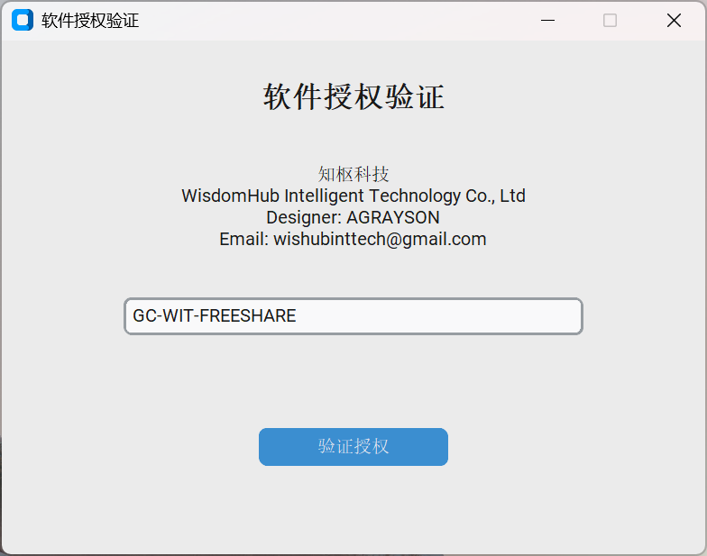
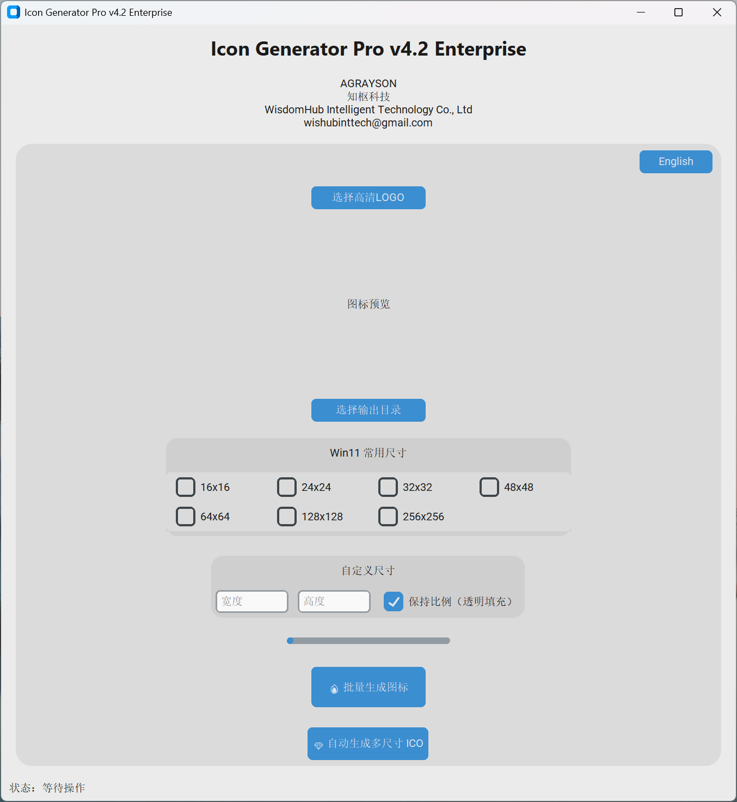

# 🔥 Icon Generator Pro v4.2 Enterprise

<p align="center">


</p>

---

## 🚀 Professional Windows 11 Icon Generator

Modern UI · Batch Export · Multi-size ICO · Enterprise Style

---

## 📸 Software Preview

<p align="center">


</p>

---

## ✨ Features

✔ Batch PNG icon generation  
✔ Auto multi-size ICO creation  
✔ Custom size support  
✔ Keep aspect ratio with transparent padding  
✔ Language switching (CN / EN)  
✔ License activation system  
✔ Enterprise branding configuration  

---

## 🔑 Free Edition License Key

This project is a **Free Share Version**.
Enter this license key GC-WIT-FREESHARE when launching the software.

---

## 📦 Run From Source

```bash
pip install -r requirements.txt
python main.py

```

---

## 💎 Download Windows EXE

👉 Download the latest compiled version from the **Releases** section:

[⬇ Click Here to Download](../../releases)

---

## 👤 Author & Company

**Designer:** AGRAYSON  
**Company:** WisdomHub Intelligent Technology Co., Ltd  
**Email:** wishubinttech@gmail.com  

---

## ⭐ Support This Project

If you like this project, please consider giving it a ⭐ on GitHub!

It helps the project grow and reach more developers 🚀

---
